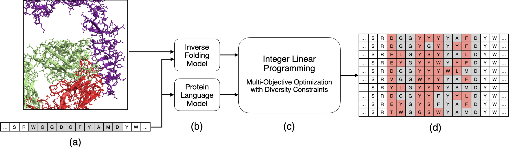

<div align="left">
  <h2>
    <picture>
    <source media="(prefers-color-scheme: dark)" srcset="images/protlib-designer-logo-name-dark.png" width="350">
    <source media="(prefers-color-scheme: light)" srcset="images/protlib-designer-logo-name-light.png" width="350">
    
    </picture>
  </h2>
</div>


[](https://www.biorxiv.org/content/10.1101/2024.11.03.621763v1)


## Introduction

Welcome to the `protlib-designer` repository! This repository contains a lightweight python library for designing diverse protein libraries by seeding linear programming with deep mutational scanning data (or any other data that can be represented as a matrix of scores per single-point mutation). The software takes as input the score matrix, where each row corresponds to a mutation and each column corresponds to a different source of scores, and outputs a subset of mutations that maximize the diversity of the library while Pareto-optimizing the scores from the different sources.

The paper [Antibody Library Design by Seeding Linear Programming with Inverse Folding and Protein Language Models](https://www.biorxiv.org/content/10.1101/2024.11.03.621763v1) uses this software to design diverse antibody libraries by seeding linear programming with scores computed by Protein Language Models (PLMs) and Inverse Folding models.

<figure>

<figcaption>
<p class="figure-caption text-center">
<em> protlib-designer designs diverse protein libraries by seeding linear programming with deep mutational scanning data. (a) The input to the method is target protein sequence and, if available, a structure of the protein or protein complex (in this case, the antibody trastuzumab in complex with the HER2 receptor). (b) We generate in silico deep mutational scanning data using protein language and inverse folding models. (c) The result is fed into a multi-objective linear programming solver. (d) The solver generates a library of antibodies that are co-optimized for the in silico scores while satisfying diversity constraints. 
</em>
</p>
</figcaption>
</figure>

## Getting Started

In this section, we provide instructions on how to install the software and run the code.

### Installation

Create an environment with Python >=3.7,<3.11 and install the dependencies:
```bash
python -m venv .venv
source .venv/bin/activate
pip install -e .
```

If you want a nice development environment, you can install the development dependencies:
```bash
pip install -e .[dev]
```
which will allow you to run the tests and the linter. You can run the linting with:
```bash
black -S -t py39 protlib_designer scripts && \
flake8 --ignore=E501,E203,W503 protlib_designer scripts
```

### Run the code

To run the code to create a diverse protein library of size 10 from the example data, run the following command:

```bash
protlib-designer ./example_data/trastuzumab_spm.csv 10
```

We provide a rich set of command-line arguments to customize the behavior of `protlib-designer`. For example, the following command runs `protlib-designer` with a range of 3 to 5 mutations per sequence, enforcing the interleaving of the mutant order and balancing the mutant order, and using a weighted multi-objective optimization:

```bash
protlib-designer ./example_data/trastuzumab_spm.csv 10 \
--min-mut 3 --max-mut 5 --interleave-mutant-order True --force-mutant-order-balance True \
--weighted-multi-objective True
```

For more information on the command-line arguments, run:

```bash
protlib-designer --help
```

### Input data

The input to the software is a matrix of per-mutation scores (the csv file `trastuzumab_spm.csv` in the example above). Typically, the score matrix is defined by *in silico* deep mutational scanning data, where each row corresponds to a mutation and each column corresponds to the score computed by a deep learning model. See the example data in the `example_data` directory for an example of the input data format. The structure of the input data is shown below:

| MutationHL | score-1 | score-2 | ... | score-N |
|------------|--------|--------|-----|--------|
| AH106C     | -0.1    | 0.2    | ... | 0.3    |
| AH106D     | 0.2    | -0.3    | ... | -0.4    |
| ...        | ...    | ...    | ... | ...    |
| YH107A     | -0.3    | 0.4    | ... | -0.5    |
| ...        | ...    | ...    | ... | ...    |

Important notes about the input data:

• The `MutationHL` column contains the mutation in the format : `WT_residue` + `chain` + `position_index` + `mutant_residue`. For example, `A+H+106+C = AH106C` represents the mutation of the residue at position 106 in chain H from alanine to cysteine.

• The `score-1`, `score-2`, ..., `score-N` columns contain the scores computed by the deep learning models for each mutation. Typically, the scores are the negative log-likelihoods ratios of the mutant residue and the wild-type residue, computed by the deep learning model: 

```math
s_{ij}^{\text{PLM}} =  -\log \left( \frac{p(x_i = a_j | w)}{p(x_i = w_i | w)} \right) =  -\log(p(x_i = a_j | w)) + \log(p(x_i = w_i | w)),
```

where $w$ is the wild-type sequence, and $p(x_i = a_j | w)$ is the probability of the mutant residue $a_j$ at position $i$ given the wild-type sequence $w$ as estimated by a Protein Language Model (PLM) or an Inverse Folding model (or any other deep learning model). For example, in [Antibody Library Design by Seeding Linear Programming with Inverse Folding and Protein Language Models](https://www.biorxiv.org/content/10.1101/2024.11.03.621763v1), we used the scores computed by the [ProtBert](https://pubmed.ncbi.nlm.nih.gov/34232869/) and [AntiFold](https://arxiv.org/abs/2405.03370) models.

## Contributing

Please read [CONTRIBUTING.md](./CONTRIBUTING.md) for details on our code of conduct, and the process for submitting pull requests to us.

## Citation

If you use this software in your research, please cite the following paper:

Hayes, C. F., Magana-Zook, S. A., Gonçalves, A., Solak, A. C., Faissol, D., & Landajuela, M. (2024). *Antibody Library Design by Seeding Linear Programming with Inverse Folding and Protein Language Models*. **bioRxiv**. [https://doi.org/10.1101/2024.11.03.621763](https://doi.org/10.1101/2024.11.03.621763)

## License

`protlib-designer` is released under an MIT license. For more details, please see the
[LICENSE](./LICENSE) and [RELEASE](./RELEASE) files. All new contributions must be made under the MIT license.

SPDX-License-Identifier: MIT

LLNL-CODE-2001645